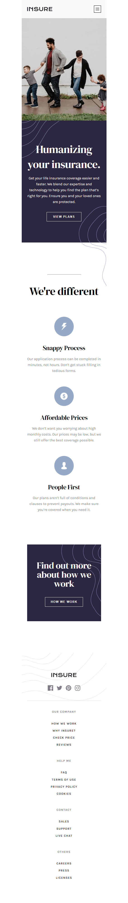

# Frontend Mentor - Insure landing page

This is a solution to the [Insure landing page challenge on Frontend Mentor](https://www.frontendmentor.io/challenges/insure-landing-page-uTU68JV8). 

## Screenshot

## Links

- Solution URL: [GitHub repo](https://github.com/TimWang95/insure-landing-page)
- Live Site URL: [solution Demo](https://645f7e3b0459693b7a85247b--rococo-starburst-8a4b40.netlify.app/)

## Built with

## Author
- [GitHub](https://github.com/TimWang95)

- [Forntend Mentor](https://www.frontendmentor.io/profile/TimWang95)

## Acknowledgments

- Challenge was provided by [Frontend Mentor](https://www.frontendmentor.io/home)
